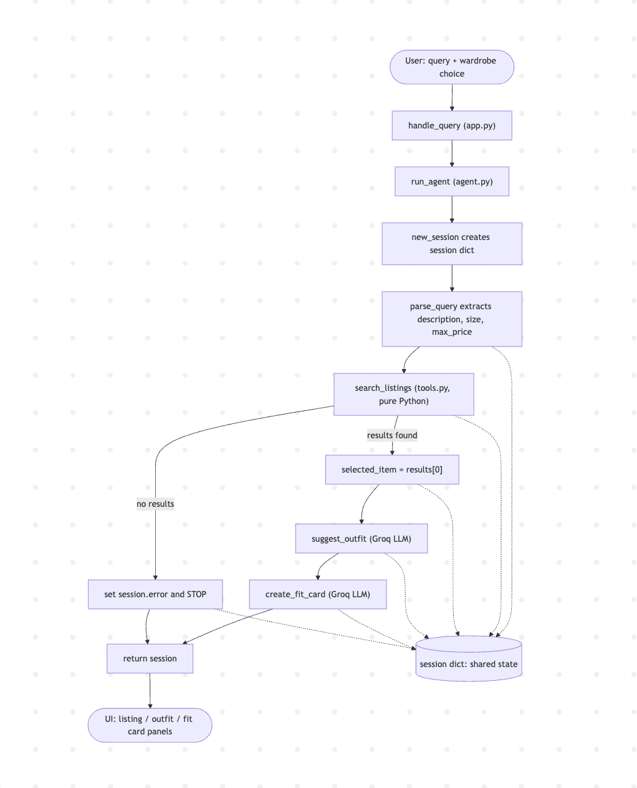

# FitFindr — planning.md

> Complete this document before writing any implementation code.
> Your spec and agent diagram are what you'll use to direct AI tools (Claude, Copilot, etc.) to generate your implementation — the more specific they are, the more useful the generated code will be.
> Your planning.md will be reviewed as part of your submission.
> Update it before starting any stretch features.

---

## Tools

List every tool your agent will use. For each tool, fill in all four fields.
You must have at least 3 tools. The three required tools are listed — add any additional tools below them.

### Tool 1: search_listings

**What it does:**
<!-- Describe what this tool does in 1–2 sentences -->
search_listings will inspect all of the listings in data/listing.json file with similar descriptions to that of the query sent by the user. It shall return three items sorted by relavance. 

**Input parameters:**
<!-- List each parameter, its type, and what it represents -->
- `description` (str): A brief description of the item the user is anticipating to look for in the listings catalog
- `size` (str): The size of the item they are looking for (could be m, l, xl, or even 5, 7, 19, etc)
- `max_price` (float): The highest price amount the user is willing to pay for the item they are looking for. 

**What it returns:**
<!-- Describe the return value — what fields does a result contain? -->
A list of up to three listing dictionaries sorted by relevance to the query. Each listing contains fields such as `id`, `title`, `description`, `category`, `price`, `size`, `colors`, and other metadata from `data/listings.json`.

**What happens if it fails or returns nothing:**
If no listings match, the agent should stop the planning loop early, set a helpful session error message like "No matching thrift finds were found for your query," and not call `suggest_outfit` or `create_fit_card`.

---

### Tool 2: suggest_outfit

**What it does:**
Given a selected thrift listing and the user's wardrobe, this tool produces a natural-language outfit suggestion for the new item.

**Input parameters:**
<!-- List each parameter, its type, and what it represents -->
- `new_item` (dict): The selected thrift listing dict from `search_listings`.
- `wardrobe` (dict): The user's wardrobe dict, containing an `items` list that may be empty.

**What it returns:**
A non-empty string describing 1–2 full outfit ideas that use the new item, ideally referencing pieces from the wardrobe when available.

**What happens if it fails or returns nothing:**
If the wardrobe is empty, the tool prompts the LLM for general styling advice for the new item rather than raising an exception. If the Groq API call itself fails (no key, network error, rate limit), the exception is caught and a short fallback string is returned so the planning loop continues — it never raises and never returns an empty string.

---

### Tool 3: create_fit_card

**What it does:**
Generate a short social-caption-style blurb describing the outfit suggestion and the thrifted item.

**Input parameters:**
<!-- List each parameter, its type, and what it represents -->
- `outfit` (str): The outfit suggestion string returned by `suggest_outfit`.
- `new_item` (dict): The selected thrift listing dict used for context.

**What it returns:**
A 2–4 sentence caption suitable for an Instagram/TikTok-style fit card, mentioning the item name, price, platform, and overall vibe.

**What happens if it fails or returns nothing:**
If `outfit` is missing or blank, return a guard message telling the user to generate an outfit first (no LLM call is made). If the Groq API call fails, the exception is caught and a fallback caption is returned instead of raising.

---

### Additional Tools (if any)

<!-- Copy the block above for any tools beyond the required three -->

---

## Planning Loop

**How does your agent decide which tool to call next?**
<!-- Describe the logic your planning loop uses. What does it look at? What conditions change its behavior? How does it know when it's done? -->
The planning loop is decision driven rather than blindly sequential. It first parses the query to understand intent and parameters. Then it uses the results of each tool call to decide whether the next tool is necessary: 

```
if the query includes an item search intent -> call `search_listings` first

if `search_listings` returns results -> call `suggest_outfit` with the selected top item and wardrobe.

if `search_listings` returns no results -> stop early and set an error message. 

if `search_outfit` returns a valid outfit string -> call `create_fit_card` 

if `search_outfit` returns no usable outfit text -> return a fallback response instead of forcing `create_fit_card` 

if the query is purely about styling a known items from the wardrobe and not searching for a listing, the loop can skip `seach_listings` and move directly to `suggest_outfit` 

This means the agen reacts to what it receives~ seach output, wardrobe contents, and the quality of the outfit suggestion
```
---

## State Management

**How does information from one tool get passed to the next?**
<!-- Describe how your agent stores and accesses state within a session. What data is tracked? How is it passed between tool calls? -->
The agent stores everything in a single request scoped session dict inside `agent.py`. Each step writes its output into the session and the next step reads the relevant fields from that dict.

Tracked session fields include:
- `query`: the original user input
- `parsed`: extracted search parameters such as `description`, `size`, and `max_price`
- `search_results`: the results returned by `search_listings()`
- `selected_item`: the chosen top listing used for styling
- `wardrobe`: the selected wardrobe object from `app.py`
- `outfit_suggestion`: the string returned by `suggest_outfit()`
- `fit_card`: the caption returned by `create_fit_card()`
- `error`: any early failure message that stops the loop

Passage between tools is explicit:
1. `search_listings()` uses `session["parsed"]` and writes `session["search_results"]`
2. the agent selects `session["selected_item"]`
3. `suggest_outfit(session["selected_item"], session["wardrobe"])` writes `session["outfit_suggestion"]`
4. `create_fit_card(session["outfit_suggestion"], session["selected_item"])` writes `session["fit_card"]`

If any step fails, `session["error"]` is set and later tools are skipped.

---

## Error Handling

For each tool, describe the specific failure mode you're handling and what the agent does in response.

| Tool | Failure mode | Agent response |
|------|-------------|----------------|
| search_listings | No results match the query | Set `session["error"]` to a helpful message and stop the loop before calling any downstream tools. |
| suggest_outfit | Wardrobe is empty | Return general styling advice instead of failing, so the UI can still show a recommendation. |
| create_fit_card | Outfit input is missing or incomplete | Return a safe fallback caption describing the item and its vibe instead of raising an exception. |

---

## Architecture

<!-- Draw a diagram of your agent showing how the components connect:
     User input → Planning Loop → Tools (search_listings, suggest_outfit, create_fit_card)
                                                                          ↕
                                                                   State / Session
     Show what triggers each tool, how state flows between them, and where error paths branch off.
     ASCII art, a Mermaid diagram (https://mermaid.js.org/syntax/flowchart.html), or an embedded
     sketch are all fine. You'll share this diagram with an AI tool when asking it to implement
     the planning loop and each individual tool. -->



**Notes on what's implemented vs. planned above:**
search_listings is implemented using pure Python and does not use an LLM. It searches through the listings loaded from load_listings() and ranks results based on keyword overlap with the user's query.

suggest_outfit and create_fit_card both use the Groq LLM (llama-3.3-70b-versatile) through a shared _chat() helper function. If the API is unavailable or an error occurs, each tool has a fallback response so the agent can continue running instead of crashing.

Edge cases are handled within each tool. If the user does not have any wardrobe items saved, suggest_outfit provides general styling recommendations for the selected item. If an outfit suggestion is missing or empty, create_fit_card returns a fallback message instead of attempting to generate a caption.

## AI Tool Plan

<!-- For each part of the implementation below, describe:
     - Which AI tool you plan to use (Claude, Copilot, ChatGPT, etc.)
     - What you'll give it as input (which sections of this planning.md, your agent diagram)
     - What you expect it to produce
     - How you'll verify the output matches your spec before moving on

     "I'll use AI to help me code" is not a plan.
     "I'll give Claude my Tool 1 spec (inputs, return value, failure mode) and ask it to implement
     search_listings() using load_listings() from the data loader — then test it against 3 queries
     before trusting it" is a plan. -->

**Milestone 3 — Individual tool implementations:**
I leveraged Claude (Claude Code) to help with the implementation of each tool individually. I prompted it with tool specifications, architecture diagrams, and desired failure behavior and assessed the resulting code to see if it met the project's criteria. After implementing each tool, I refined the logic, tested edge cases, and validated that the tool's function aligned with what was described in this plan, before incorporating it into the agent pipeline.

Search_listings was written in pure python using loadlistings(). This tool searches listings based on a keyword overlap scoring, and common stop-words are filtered, title matches are weighted more than other fields. Optional size and max-price filters can be included. Top 3 matches are returned, or an empty list if there are no matches.

Suggest_outfit and createfitcard were both written using Groq LLM (llama-3.3-70b-versatile) using a helper function called chat(). I write dynamically generated prompts using the selected item and the wardrobe data. Fallbacks are included for each so that the agent doesn't stop running if the API fails.

I tested the pure-python parts of searchlistings using pytest to check keyword matches, filter results, and empty lists. I manually tested suggestoutfit and createfitcard to ensure they mention the item chosen as well as the wardrobe items (if any were available) and produce the appropriate caption for different listings.

**Milestone 4 — Planning loop and state management:**
Passed Claude Planning Loop + State Management chunks to implement runagent() in agent.py parse early-exit query searchlistings with session["error"] if there are no results pick top item suggestoutfit createfit_card return the session All state goes through the single session dict
- Found 2 bugs and fixed it in this milestone the parsing in parsequery now parse price then size (so the 30 in $ 30 doesn't get caught by size) and removed the span with slice instead of replace re.sub with the matching string (the $ is a metachar so that was causing issues)

- Verify python agent.py runs happy and no results path, parsing/scoring regressions are caught by test suite

---

## A Complete Interaction (Step by Step)

Write out what a full user interaction looks like from start to finish — tool call by tool call. Use a specific example query.

**Example user query:** "I'm looking for a vintage graphic tee under $30. I mostly wear baggy jeans and chunky sneakers. What's out there and how would I style it?"

**Step 1 — Parse the query:**
`run_agent()` initializes the session and calls `_parse_query()`, which extracts:

`description="looking for a vintage graphic tee"`, `size=None`, `max_price=30.0`.

(The `$30` is consumed as the price ceiling, *not* mistaken for a size.)

**Step 2 — Search listings:**
`search_listings("looking for a vintage graphic tee", size=None, max_price=30.0)` is called.
Stopwords are dropped (`looking`, `for`, `a`), leaving `{vintage, graphic, tee}`. 

Title-weighted
scoring ranks the actual tee first; `"Graphic Tee — 2003 Tour Bootleg Style"` ($24) is selected as
`session["selected_item"]`. Because results are non-empty, the loop continues.

**Step 3 — Suggest an outfit:**
`suggest_outfit(selected_item, wardrobe)` builds a prompt from the tee plus the user's wardrobe
(baggy jeans, chunky sneakers, etc.) and asks the Groq LLM for 1–2 outfits using those pieces by name.
**The result is stored in `session["outfit_suggestion"]`.**

**Step 4 — Create the fit card.**
`create_fit_card(outfit_suggestion, selected_item)` calls the LLM (higher temperature) to write a
2–4 sentence caption mentioning the item, price ($24), and platform. Stored in `session["fit_card"]`.

**Final output to user:**
The Gradio UI displayed has three panels: the listing (Graphic Tee, $24, platform + description), the outfit idea calling back to the user's baggy jeans and chunky sneakers, and the shareable fit-card caption. If no results were returned for the search (i.e., 'designer ballgown size XXS under $5'), then the first panel would display the error message and the other two would be blank.